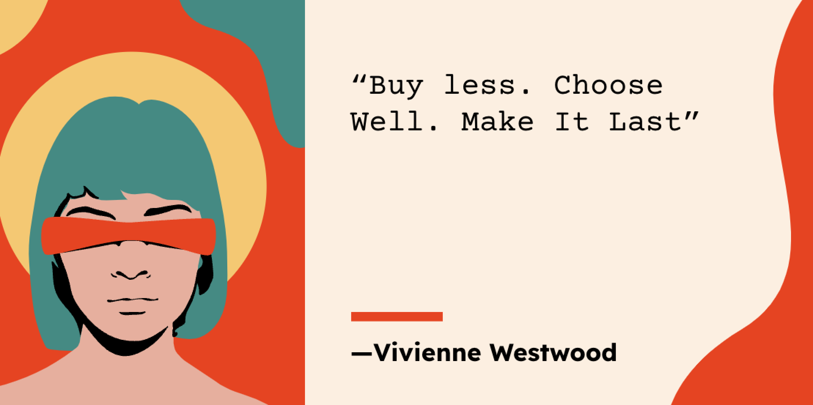

# Ethical-Fashion

## Description
Interactive dashboard exploring ethical fashion metrics

## Table of Contents
- [Installation](#installation)
- [Codes_Resources](#codes-and-resources-used)
- [Packages](#python-and-javascript-packages-used)
- [Data](#data)
- [Credits](#credits)
- [License](#license)
- [Credits](#credits)
- [Presentation](#presentation)
- [Contact](#contact)

## Installation
To load data from the Jupyter Notebook into PostgreSQL, we use the psycopg2 library. Install it using the following command: pip install psycopg2 
To enable cross-origin sharing for our JavaScript, we use 'Flas-CORS' in our Flas API. Install with the following command: pip install Flask-CORS

## Codes and Resources Used
- **Python Version: 3.11.4**
- **SQL**
- **JavaScript**
- **HTML**

## Python and JavaScript Packages Used
- **Data Manipulation:** `pandas, sqlalchemy, numpy`
- **Data Visualization:** `plotly, d3, AOS`

# Data

## Source Data
- #### [Sustainable Sourcing Materials Dataset:](https://wikirate.org/Fashion_Revolution+5_3_Sustainable_Sourcing_Materials) The score the company received for procuring raw materials is a manner that minimizes environmental impact.
- #### [Deforestation and Regeneration Dataset:](https://wikirate.org/Fashion_Revolution+Decarbonisation_Deforestation_and_Regeneration_Score) The score the company received for deforestation and reforestation efforts.
- #### [Overconsumption, Waste and Circularity:](https://wikirate.org/Fashion_Revolution+5_4_Overconsumption_Waste_Circularity) The score the company received to reducing waste in the fashion industry.
- #### [Towards Paying Living Wages Dataset:](https://wikirate.org/Fashion_Revolution+Towards_Paying_Living_Wages_Score_2021) The score the company received for their commitment to fair compensation.
- #### [Fashion Tranparecy Index:](https://wikirate.org/Fashion_Transparency_Index_2021_full_dataset?select2Id=12&slotSelector=._filter-result-slot&remote=&filter%5Bcompany_name%5D=&sort_by=company_name) List of companies and their headquarters.

## Data Preprocessing
Once we a acquired the data .csv files from Wiki rate we had to clean up the data by renaming columns, handlig missing values, and data merging.

# Results and evaluation
In the 4 metrics we discussed (Sustainability, Deforestation, Overconsumption, and Living Wages) Sweden and Hong Kong are the top rated countries overall. Gucci a company based in Italy has the highest overall score across over 200+ companies.  

## License
MIT

## Credits
- Arpita Sharma
- Aspen Jack
- Christina Zermeno
- Samin Nikkhoo
- Velvet Robinson

## Presentation
##### [Ethical Fashion](https://docs.google.com/presentation/d/1KBZ5DekFBhwf85SwLfIWu-px6HFmbRi0PuHEEKDg_lw/edit#slide=id.p)

## Contact
If there are any questions of concerns, we can be reached at:
##### [github: aspenjack](https://github.com/aspenjack)
##### [github: Samin-nik](https://github.com/Samin-nik)
##### [github: arpitas0690](https://github.com/arpitas0690)
##### [github: christinazermeno](https://github.com/christinazermeno)
##### [github: velvetklr](https://github.com/velvetklr)

